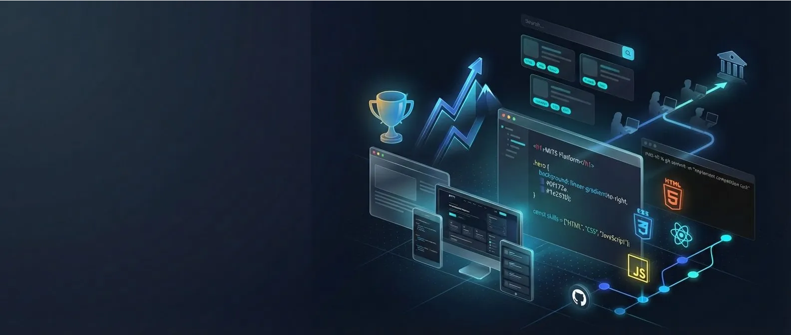

# MITS Design & Implementation Tutorial



> Készíts **éles, 4 oldalas professzionális weboldalt** kizárólag HTML5 és CSS3 segítségével — JavaScript nélkül, keretrendszer nélkül, csak tiszta webes alapok.

[](.)
[](.)
[](.)
[](.)
[](.)

---

## 📚 Áttekintés

A **MITS Design & Implementation Tutorial** megmutatja, hogyan építhetsz professzionális weboldalakat tiszta HTML5 és CSS3 segítségével. Egy komplett promóciós weboldalt fogsz készíteni a MITS (Marketable IT Skills) platformhoz — sötét témájú, 4 oldalas site, háttérképes hero szekcióval, reszponzív projekt kártyákkal, akadálymentes navigációval és teljes mobilos támogatással.

Nincs rövidítés. Nincs keretrendszer. Minden egyes sort megértesz, amit írsz.

### Mit fogsz megépíteni

Egy teljes **MITS Platform promóciós weboldal** 4 teljesen stílusozott, akadálymentes, reszponzív oldallal:

| Oldal             | Tartalom                                                         |
| ----------------- | ---------------------------------------------------------------- |
| **Főoldal**       | Hero szekció, projekt kártya rács, cselekvésre ösztönző szekciók |
| **Rólunk**        | Küldetésnyilatkozat, funkció rács, projekt célok                 |
| **Útmutató**      | Lépésről lépésre regisztrációs útmutató, előfeltételek           |
| **Együttműködés** | Közreműködési lehetőségek, kapcsolatfelvétel                     |

A végeredmény egy **éles, GitHub Pages-en tárolt portfólió projekt** 90+ Lighthouse pontszámmal minden kategóriában.

### Kinek szól ez a kurzus

- **Kezdő webfejlesztőknek**, akik HTML/CSS alapokat tanulnak nulláról
- **Bootcamp hallgatóknak**, akik a keretrendszerek előtt szeretnék mélyen megérteni a webszabványokat
- **Önképző fejlesztőknek**, akik erős alapokat építenek
- **Szakképzős IT-s hallgatóknak**, akik webdesign versenyekre készülnek (EuroSkills, WorldSkills)
- **Mindenkinek**, aki előre elkészített komponens könyvtárak nélkül szeretne weboldalt építeni

---

## 🎯 Mit fogsz tanulni

Mind a 8 modul teljesítésével képes leszel:

- ✅ **Szemantikus HTML5-t írni** — helyes dokumentumstruktúra, beépített akadálymentességgel
- ✅ **CSS design rendszert létrehozni** — CSS egyéni tulajdonságok (változók) színekhez, térközökhöz és tipográfiához
- ✅ **Modern elrendezéseket készíteni** — CSS Grid a 2D elrendezésekhez, Flexbox az 1D elrendezésekhez (soha nem float)
- ✅ **Sötét témát tervezni** — professzionális színpaletta a MITS platform esztétikájához igazítva
- ✅ **Újrafelhasználható komponenseket stílusozni** — gombok, kártyák, jelvények, tag-ek — minden UI építőkő
- ✅ **CSS pszeudo-elemeket használni** — `::before` egyéni felsorolásjelekhez, CSS számlálók automatikus számozáshoz
- ✅ **Professzionális csiszolást hozzáadni** — `@keyframes` animációk, `scroll-behavior: smooth`, fókuszgyűrűk
- ✅ **Reszponzív elrendezéseket építeni** — `clamp()` tipográfia, `auto-fit` rácsok, csak CSS-es hamburger menü
- ✅ **Akadálymentességet biztosítani** — WCAG AA megfelelőség, ARIA jelölők, skip linkek, billentyűzetes navigáció
- ✅ **SEO-ra optimalizálni** — Open Graph tag-ek, JSON-LD strukturált adat, `sitemap.xml`, `robots.txt`
- ✅ **Éles üzembe helyezni** — GitHub Pages telepítés, Lighthouse auditálás
- ✅ **Professzionális Git-et használni** — feature branch-ek, értelmes commit üzenetek, GitHub push

---

## 📋 Előfeltételek

**Kötelező:**

- Alapszintű számítógépes ismeretek (mappák létrehozása, fájlok megnyitása)
- Modern webböngésző — Chrome, Firefox, Edge vagy Safari
- [VS Code](https://code.visualstudio.com/) (ingyenes kódszerkesztő)
- [Git](https://git-scm.com/) telepítve
- Ingyenes [GitHub](https://github.com/) fiók

**Ajánlott:**

- VS Code [Live Server bővítmény](https://marketplace.visualstudio.com/items?itemName=ritwickdey.LiveServer) az azonnali böngésző-frissítéshez
- Alapszintű HTML tag ismeret (hasznos, de nem kötelező — nulláról tanítjuk)
- Böngésző DevTools megnyitva az oldalon (folyamatosan használjuk)

**Nem szükséges tapasztalat:**

- CSS-ben (nulláról kezdjük)
- JavaScript-ben (ebben a kurzusban egyáltalán nem használjuk)
- Parancssorban (minden parancsot lépésről lépésre elmagyarázunk)
- Keretrendszerekben (szándékosan kerüljük őket)

---

## 📖 Kurzus felépítése

### ✅ 1. modul: Csak HTML struktúra

⏱️ **Idő:** 40–55 perc

Hozz létre mind a 4 oldalt teljes szemantikus HTML5 struktúrával. A CSS fájlok be vannak linkelve, de üresen maradnak — ez tanítja a felelősségek szétválasztását, és megelőzi a kognitív túlterhelést a stílusozás előtt.

**Mit fogsz tanulni:**

- HTML5 szemantikus elemek (`<header>`, `<nav>`, `<main>`, `<section>`, `<article>`, `<footer>`)
- Megfelelő fejléc hierarchia (oldalanként egy H1, majd H2–H6 sorrendben)
- Többoldalas weboldal struktúra és belső linkek
- CSS fájlszervezési stratégia (6 CSS fájl egyértelmű felelősségekkel)
- HTML validáció a W3C validátorral

**Leadandó:** 4 oldalas, stílus nélküli weboldal tökéletes szemantikus HTML-lel — CSS nélkül is olvasható

[📖 Áttekintés](module-1/overview.md) | [🔨 Workshop](module-1/workshop.md) | [✅ Megoldás](module-1/solution/)

---

### ✅ 2. modul: CSS alapok — Alap és elrendezés

⏱️ **Idő:** 60–75 perc

Alakítsd át a stílus nélküli HTML-t professzionálisan stílusozott, sötét témájú weboldallá. Ez a modul építi fel azt a design rendszer alapot, amelyre az összes többi modul támaszkodik.

**Mit fogsz tanulni:**

- CSS reset és a dobozmodell (`box-sizing: border-box`)
- CSS egyéni tulajdonságok (változók) színekhez, térközökhöz és tipográfiához
- Sötét téma színpaletta (`#0f172a` háttér, `#06b6d4` kiemelés)
- Tipográfiai hierarchia — fejlécek, törzsszöveg, linkek
- Flexbox 1D elrendezésekhez (ragadós fejléc, navigáció)
- CSS Grid 2D elrendezésekhez (lábléc oszlopok)
- Ragadós pozicionálás a fejléchez

**Leadandó:** Sötét témájú weboldal stílusozott fejléccel, lábléccsel és egységes tipográfiával mind a 4 oldalon

[📖 Áttekintés](module-2/overview.md) | [🔨 Workshop](module-2/workshop.md) | [✅ Megoldás](module-2/solution/)

---

### ✅ 3. modul: Főoldal stílusozása (`index.css`)

⏱️ **Idő:** 75–90 perc

A legösszetettebb oldalt stílusozd először. A főoldal bevezeti a kulcsfontosságú komponens mintákat — gombok, hero háttérképpel, projekt kártyák —, amelyek az egész kurzuson át visszaköszönnek.

**Mit fogsz tanulni:**

- CSS komponens design minták (`.btn`, `.btn-primary`, `.btn-secondary`)
- Háttérképek `background-size: cover` és `background-position` segítségével
- Lineáris gradiens átfedések a szöveg olvashatóságához képek felett
- Interaktív kártya komponensek: `transform: translateY()`, `box-shadow`, hover átmenetek
- CSS Grid `repeat(3, 1fr)` a projekt kártya rácshoz
- Jelvény és tag stílusozás félátlátszó hátterekkel

**Leadandó:** Lenyűgöző főoldal hero képpel, stílusozott gombokkal, hover effektusú projekt kártyákkal és teljes vizuális hierarchiával

[📖 Áttekintés](module-3/overview.md) | [🔨 Workshop](module-3/workshop.md) | [✅ Megoldás](module-3/solution/)

---

### ✅ 4. modul: Rólunk oldal stílusozása (`about.css`)

⏱️ **Idő:** 60–75 perc

Alkalmazd a design rendszert a Rólunk oldalon fejlettebb CSS technikákkal — bemutatva az `auto-fit` rácsokat, amelyek médialekérdezések nélkül reagálnak a tartalomra, és pszeudo-elem egyéni felsorolásjeleket.

**Mit fogsz tanulni:**

- Oldalspecifikus CSS architektúra (egy CSS fájl oldalanként)
- Szekció háttér váltakozás vizuális ritmushoz
- CSS pszeudo-elemek (`::before`) egyéni nyíl felsorolásjelekhez
- CSS Grid `auto-fit` + `minmax(240px, 1fr)` — reszponzív médialekérdezések nélkül
- `filter: grayscale(1)` dekoratív emoji ikonokhoz
- `p:first-of-type` szelektor tipográfiai kiemelő hangsúlyhoz

**Leadandó:** Teljesen stílusozott Rólunk oldal reszponzív funkció ráccsal és egyéni vizuális elemekkel

[📖 Áttekintés](module-4/overview.md) | [🔨 Workshop](module-4/workshop.md) | [✅ Megoldás](module-4/solution/)

---

### ✅ 5. modul: Útmutató és Együttműködés oldalak stílusozása

⏱️ **Idő:** 75–90 perc

Stílusozd a weboldal utolsó két oldalát. Az Útmutató oldalon CSS számlálók biztosítják az automatikus lépésszámozást; az Együttműködés oldalon lehetőség kártya rácsok és flex igazítás valósul meg a kapcsolati információkhoz.

**Mit fogsz tanulni:**

- CSS számlálók (`counter-reset`, `counter-increment`, `counter()`) automatikusan számozott lépésekhez
- `::before` pszeudo-elem mint stílusozott számozott kör
- Flexbox a lépés elrendezéshez (számkör + tartalom egymás mellett)
- `text-transform: uppercase` + `letter-spacing` cimke tipográfiához
- `align-items: baseline` + `min-width` igazított cimke/érték kapcsolati sorokhoz
- `margin-top: auto` elemek flex konténer aljára tolásához

**Leadandó:** Mind a 4 oldal teljesen stílusozva — kész, portfólióba rakható MITS weboldal

[📖 Áttekintés](module-5/overview.md) | [🔨 Workshop](module-5/workshop.md) | [✅ Megoldás](module-5/solution/)

---

### ✅ 6. modul: Csiszolás és haladó CSS technikák

⏱️ **Idő:** 60–75 perc

Adj professzionális csiszolást az egész weboldalhoz egyetlen `enhancements.css` fájlon keresztül. Nincs új oldal — csak egy új fájl, amely felemeli az egész élményt.

**Mit fogsz tanulni:**

- `scroll-behavior: smooth` natív sima görgetéshez
- Skip-to-content link (vizuálisan rejtett, fókuszálásig)
- `:focus` vs `:focus-visible` — billentyűzetes gyűrű egér kontúr nélkül
- `@keyframes` `fadeInUp` animáció `<main>` oldalbetöltésre
- `@media (prefers-reduced-motion: reduce)` — akadálymentes animáció kikapcsolás
- `@media print` — fehér háttér, rejtett navigáció, tiszta nyomtatott kimenet

**Leadandó:** Csiszolt 4 oldalas weboldal sima interakciókkal, billentyűzetes akadálymentességgel, fade-in animációkkal és nyomtatásbarát kimenettel

[📖 Áttekintés](module-6/overview.md) | [🔨 Workshop](module-6/workshop.md) | [✅ Megoldás](module-6/solution/)

---

### ✅ 7. modul: Reszponzív design — Mobile First

⏱️ **Idő:** 90–120 perc

Tedd a desktop-first weboldalt minden képernyőméreten gyönyörűen működővé — 320 px-es telefonoktól a széles monitorokig — egyetlen `responsive.css` fájl és egy csak CSS-es hamburger menü segítségével.

**Mit fogsz tanulni:**

- `clamp(min, preferred, max)` folyékony tipográfiához médialekérdezések nélkül
- Csak CSS-es hamburger navigáció: rejtett `<input type="checkbox">` + `:checked` + `~` testvér szelektor
- Hamburger → ✕ animáció `transform: translateY() rotate()` segítségével
- `@media (max-width: 1023px)` tablet töréspontok
- `@media (max-width: 767px)` mobil töréspontok
- `position: absolute; top: 100%` a legördülő navigáció panelhez
- Érintésbarát érintési célterületek (minimum 44 × 44 px)
- Böngésző DevTools eszköz emuláció reszponzív teszteléshez

**Leadandó:** Teljesen reszponzív 4 oldalas weboldal, amely 320 px-es telefonoktól asztali gépekig alkalmazkodik, működő CSS hamburger menüvel

[📖 Áttekintés](module-7/overview.md) | [🔨 Workshop](module-7/workshop.md) | [✅ Megoldás](module-7/solution/)

---

### ✅ 8. modul: Akadálymentesség, SEO és éles telepítés

⏱️ **Idő:** 90–120 perc

Az utolsó modul éles üzemre késszé teszi a weboldalt: WCAG AA megfelelő, a keresőmotorok által felfedezhető, és élőben elérhető a GitHub Pages-en 90+ Lighthouse pontszámmal.

**Mit fogsz tanulni:**

- `aria-label="Main navigation"` a `<nav>` elemen képernyőolvasó tájékozódáshoz
- `aria-current="page"` az aktív navigációs linken
- Logo mint navigációs link helyes akadálymentes névvel (redundáns bejelentések nélkül)
- `aria-hidden="true"` dekoratív emoji ikonokhoz
- Oldal `<title>` legjobb gyakorlatok (50–60 karakter)
- `<meta name="description">` (120–158 karakter)
- Open Graph tag-ek (`og:title`, `og:description`, `og:image`, `og:type`) közösségi megosztáshoz
- Twitter Card tag-ek megosztási előnézetekhez
- `<link rel="canonical">` és `<meta name="theme-color">`
- JSON-LD strukturált adat (`WebSite` + `WebPage` sémák)
- `sitemap.xml` és `robots.txt`
- GitHub Pages telepítés és Lighthouse auditálás

**Leadandó:** Élő, nyilvánosan elérhető weboldal, telepítve a GitHub Pages-en, WCAG AA akadálymentességgel, teljes SEO metaadatokkal és 90+ Lighthouse pontszámmal

[📖 Áttekintés](module-8/overview.md) | [🔨 Workshop](module-8/workshop.md) | [✅ Megoldás](module-8/solution/)

---

## 📚 Modulok áttekintése

| Modul          | Cím                                   | Állapot | Idő         | Kulcsfogalom                                 |
| -------------- | ------------------------------------- | ------- | ----------- | -------------------------------------------- |
| [1](module-1/) | Csak HTML struktúra                   | ✅ Kész | 40–55 perc  | Szemantikus HTML5, W3C validáció             |
| [2](module-2/) | CSS alapok — Alap és elrendezés       | ✅ Kész | 60–75 perc  | CSS változók, Flexbox, Grid                  |
| [3](module-3/) | Főoldal stílusozása                   | ✅ Kész | 75–90 perc  | Komponensek, hero kép, kártyák               |
| [4](module-4/) | Rólunk oldal stílusozása              | ✅ Kész | 60–75 perc  | `::before`, `auto-fit`, grayscale szűrő      |
| [5](module-5/) | Útmutató és Együttműködés stílusozása | ✅ Kész | 75–90 perc  | CSS számlálók, flex igazítás                 |
| [6](module-6/) | Csiszolás és haladó CSS               | ✅ Kész | 60–75 perc  | Animációk, fókuszgyűrűk, nyomtatási stílusok |
| [7](module-7/) | Reszponzív design                     | ✅ Kész | 90–120 perc | `clamp()`, hamburger menü, töréspontok       |
| [8](module-8/) | Akadálymentesség, SEO és telepítés    | ✅ Kész | 90–120 perc | ARIA, Open Graph, JSON-LD, GitHub Pages      |

**Becsült teljes idő:** 8–12 óra

---

## 🚀 Kezdés

### 1. lehetőség: Kövesd sorrendben a modulokat (ajánlott)

Minden modul közvetlenül az előzőre épül. Kövesd ezt az utat a teljes tanulási élményért:

1. Olvasd el az [1. modul áttekintését](module-1/overview.md) a fogalmak megértéséhez
2. Dolgozd végig az [1. modul workshopját](module-1/workshop.md) lépésről lépésre
3. Hasonlítsd össze a munkádat az [1. modul megoldásával](module-1/solution/), ha elakadnál
4. Lépj a 2. modulra és ismételd

**Miért működik ez:** A weboldal fokozatosan alakul át — sima HTML-ből sötét témájú elrendezéssé, majd csiszolt, reszponzív, élő weboldallá. Minden lépés azonnali vizuális eredményt hoz.

### 2. lehetőség: Klónozd és fedezd fel

```bash
# Klónozd a kurzus tárolót
git clone https://github.com/marketable-it-skills/mits-course-creator.git

# Navigálj ehhez a kurzushoz
cd mits-course-creator/courses/mits-design-implementation-tutorial

# Nyisd meg az 1. modul áttekintését
code module-1/overview.md
```

### 3. lehetőség: Használd a megoldásokat hivatkozásként

Minden modul tartalmaz egy teljes `solution/` mappát. Használd őket arra, hogy:

- Ellenőrizd, hogy az implementációd helyes-e
- Hibakereséshez hasonlítsd össze a kódodat a működő verzióval
- Lásd az egyes szakaszokban elvárt vizuális eredményt

> **Megjegyzés:** Próbálj meg minden workshopot önállóan elvégezni, mielőtt megnézed a megoldásokat. Sokkal többet tanulsz a kihívás megküzdéséből.

### 4. lehetőség: Gyorsított tanulási út (HTML/CSS alapismeretekkel rendelkezőknek)

Ha már ismered az alap HTML/CSS-t, fókuszálj a modern technikákra:

| Modul                 | Miért érdemes                                               |
| --------------------- | ----------------------------------------------------------- |
| [2. modul](module-2/) | CSS egyéni tulajdonságok — a modern temazási megközelítés   |
| [4. modul](module-4/) | `auto-fit` rácsok + pszeudo-elem felsorolásjelek            |
| [5. modul](module-5/) | CSS számlálók — hatékony és alulhasznált                    |
| [6. modul](module-6/) | `@keyframes`, `prefers-reduced-motion`, nyomtatási stílusok |
| [7. modul](module-7/) | `clamp()` + csak CSS hamburger menü                         |
| [8. modul](module-8/) | ARIA, Open Graph, JSON-LD, telepítés                        |

---

## 🛠️ Lefedett technológiák és fogalmak

### Alapvető technológiák

- **HTML5** — Szemantikus elemek, akadálymentességi attribútumok, meta tag-ek
- **CSS3** — Grid, Flexbox, egyéni tulajdonságok, animációk, médialekérdezések
- **Git és GitHub** — Verziókezelés, feature branch-ek, GitHub Pages telepítés

### CSS fogalmak modulonként

**Alap (1–3. modul)**

- Szemantikus HTML5 struktúra (`header`, `nav`, `main`, `section`, `article`, `footer`)
- CSS reset és dobozmodell (`box-sizing: border-box`)
- CSS egyéni tulajdonságok (design tokenek színekhez, térközökhöz, tipográfiához)
- Tipográfiai hierarchia (fejléc skála, sortávolság, betűvastagság)
- Flexbox 1D elrendezésekhez — fejléc navigáció, gomb csoportok
- CSS Grid 2D elrendezésekhez — lábléc oszlopok, projekt kártya rács
- Ragadós pozicionálás, konténer minta, szekció térközök
- Gomb komponensek (`.btn`, `.btn-primary`, `.btn-secondary`)
- Háttérképek gradiens átfedésekkel (`background-size: cover`)
- Kártya komponensek — hover effektusok `transform` és `box-shadow` segítségével

**Középhaladó (4–5. modul)**

- CSS pszeudo-elemek `::before` egyéni felsorolásjelekhez
- CSS Grid `auto-fit` + `minmax()` — reszponzív médialekérdezések nélkül
- CSS számlálók — automatikus sorrendi számozás
- `filter: grayscale(1)` dekoratív képekhez
- `text-transform`, `letter-spacing` cimke tipográfiához
- `align-items: baseline` igazított cimke/érték sorokhoz
- `margin-top: auto` alulra igazított flex elemekhez

**Haladó (6–8. modul)**

- `@keyframes` és az `animation` rövidítés
- `scroll-behavior: smooth` — natív sima görgetés
- `:focus-visible` — billentyűzetes gyűrű egér kontúr nélkül
- `@media (prefers-reduced-motion)` — akadálymentes animáció
- `@media print` — nyomtatásbarát stíluslap
- `clamp(min, preferred, max)` — folyékony reszponzív tipográfia
- Csak CSS hamburger: `<input type="checkbox">` + `:checked` + `~`
- `position: absolute; top: 100%` — legördülő panelek
- `aria-label`, `aria-current`, `aria-hidden` — ARIA attribútumok
- Open Graph és Twitter Card meta tag-ek
- JSON-LD strukturált adat (`schema.org`)
- `sitemap.xml` és `robots.txt`

### Professzionális gyakorlatok

- **Git munkafolyamat** — Feature branch-ek (`feat/module-N`), értelmes commit üzenetek, push a remote-ra
- **Felelősségek szétválasztása** — HTML a struktúrának, CSS a megjelenítésnek (nincs inline stílus)
- **Progresszív fejlesztés** — Minden modul megoldása a következő modul kiindulópontja
- **CSS architektúra** — Fájlonként egy felelősség (`base.css` → `layout.css` → oldalspecifikus → `enhancements.css` → `responsive.css`)
- **Akadálymentesség-első megközelítés** — WCAG AA megfelelőség minden szakaszba beépítve, nem utólag hozzáadva
- **W3C validáció** — HTML és CSS hibák ellenőrzése végig a fejlesztés során
- **Böngésző DevTools** — Hibakereséshez és reszponzív teszteléshez minden modulban

---

## 📁 Projekt struktúra

```
mits-design-implementation-tutorial/
├── module-1/                    ✅ Csak HTML struktúra
│   ├── overview.md              # Modul fogalmak és tanulási célok
│   ├── workshop.md              # Lépésről lépésre feladatok
│   └── solution/                # Teljes működő kód
│       ├── index.html
│       ├── about.html
│       ├── guide.html
│       ├── contribute.html
│       └── css/                 # Minden CSS fájl (üres az 1. modulban)
│
├── module-2/                    ✅ CSS alapok
│   └── solution/css/
│       ├── base.css             # Reset, változók, tipográfia, gombok
│       └── layout.css           # Fejléc, lábléc, konténer, szekciók
│
├── module-3/                    ✅ Főoldal
│   └── solution/
│       ├── assets/images/       # Hero kép, logó
│       └── css/index.css        # Hero, kártyák, jelvények, tag-ek — ÚJ
│
├── module-4/                    ✅ Rólunk oldal
│   └── solution/css/about.css   # Funkció rács, célok lista — ÚJ
│
├── module-5/                    ✅ Útmutató és Együttműködés oldalak
│   └── solution/css/
│       ├── guide.css            # Lépés számlálók, előfeltételek — ÚJ
│       └── contribute.css       # Lehetőség rács, kapcsolat — ÚJ
│
├── module-6/                    ✅ Csiszolás
│   └── solution/css/
│       └── enhancements.css     # Animációk, skip link, nyomtatás — ÚJ
│
├── module-7/                    ✅ Reszponzív design
│   └── solution/css/
│       └── responsive.css       # clamp(), hamburger, töréspontok — ÚJ
│
├── module-8/                    ✅ Akadálymentesség, SEO és telepítés
│   └── solution/
│       ├── *.html               # Teljes SEO meta, ARIA fejlesztések
│       ├── sitemap.xml          # ÚJ
│       ├── robots.txt           # ÚJ
│       └── css/layout.css       # Logó link javítás
│
├── assets/
│   └── images/
│       ├── course-cover-image.webp
│       └── logo-dark.svg
│
└── README_HU.md                 # ← Itt vagy!
```

> **Modul folytonosság:** Minden modul `solution/` mappája a következő modul workshopjának kiindulópontja. Ez tükrözi a valódi professzionális fejlesztést — mindig a meglévő munkára építünk.

---

## ⏱️ Időbeosztás

**Teljes kurzus:** ~8–12 óra mind a 8 modulon át

| Fázis            | Modulok | Idő      | Fókusz                                         |
| ---------------- | ------- | -------- | ---------------------------------------------- |
| Alap             | 1–3     | ~3–4 óra | HTML struktúra, CSS rendszer, főoldal          |
| Tartalmi oldalak | 4–6     | ~3–4 óra | Rólunk, Útmutató, Együttműködés, csiszolás     |
| Éles üzemre kész | 7–8     | ~3–4 óra | Reszponzív design, akadálymentesség, telepítés |

Minden modult **egy fókuszált ülésben** lehet elvégezni, és minden egyes lépés után azonnal látható vizuális eredmény keletkezik — egyetlen ülés sem ér véget anélkül, hogy valami újat ne láthatnál a böngészőben.

---

## 🌟 A kurzus kiemelkedő tulajdonságai

Mi különbözteti meg ezt a kurzust a tipikus HTML/CSS oktatóanyagoktól:

**Tiszta alapok** — Nincs utility-class keretrendszer (nincs Tailwind), nincs komponens könyvtár (nincs Bootstrap). Minden pixelt megértesz.

**Sötét téma** — A legtöbb oktatóanyag általános fehér hátteret használ. Ez a kurzus egy valódi professzionális sötét témájú platformot követ, ami nehezebb és tanulságosabb.

**Valódi design spec** — Nem nulláról tervezel. Egy konkrét designt (a MITS platform felületet) implementálsz — pontosan azt, amit a professzionális fejlesztők csinálnak.

**Modulonként egy fogalom** — A 4. modul az `auto-fit` rácsokat mutatja be. Az 5. modul a CSS számlálókat. A 7. modul a `clamp()`-et. Soha nem kap egyszerre öt új dolgot.

**Növekményes lépések teszteléssel** — Minden workshop kis darabokra bontja az implementációt, amelyek mindegyikét egy ellenőrzési lépés követ. Nem fogod véletlenül egy órányi munkát elvégezni, csak azért, hogy egy elírás mindent tönkretegyen.

**Akadálymentesség beépítve** — Skip linkek a 6. modulban jelennek meg. ARIA attribútumok a 8. modulban. Fókuszgyűrűk végig. Az akadálymentesség nem utólagos gondolat — az architektúra részét képezi az elejétől fogva.

**Élő portfólió eredmény** — A kurzus egy telepített, élő URL-lel zárul, amelyet megoszthatsz az önéletrajzodon, LinkedIn-en vagy portfóliódban.

---

## 🤝 Közreműködés

Hibát találtál vagy javaslatod van? Szívesen vesszük a visszajelzést!

- 🐛 [Nyiss egy issue-t](https://github.com/marketable-it-skills/mits-course-creator/issues)
- 🔀 Küldj pull request-et
- 💬 Csatlakozz a GitHub Discussions vitájához

---

## 💬 Támogatás

Segítségre van szükséged?

- 📧 **E-mail:** info@mits-platform.org
- 🐛 **Issues:** [GitHub Issues](https://github.com/marketable-it-skills/mits-course-creator/issues)
- 📖 **Dokumentáció:** Minden modul `overview.md` fájlja részletesen elmagyarázza a fogalmakat, mielőtt a workshop elkezdődik

---

## 📄 Licenc

Ez a kurzus a **[Marketable IT Skills (MITS) Initiative](https://github.com/marketable-it-skills)** részét képezi — oktatási anyagok a szakképzéses IT képzéshez, amelyet Európa-szerte versenyek felkészítő programjaiban használnak.

---

**Készen állsz a kezdésre?** → [1. modul: Csak HTML struktúra](module-1/overview.md) 🚀
